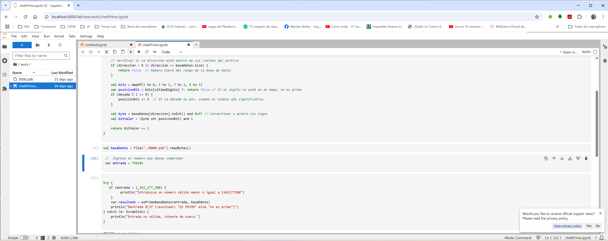

Versión kotlin
------------------
- compilador kotlin: 2.0.21
- máquina virtual java (jvm): 18 

## Comprobar si el número es PRIMO usando la Base de Datos de Números Primos
### checkPrime.kt:
- ubicación: src/main/kotlin/prime/bd
- propósito: Comprueba si el número introducido es primo (gemelo a checkPrime.py)
- rango: Puede comprobar cualquier número contenido en 0000.pdb, es decir, entre el 11 y 1.342.177.289
   
### checkPrime_ver2.kt:
- ubicación: src/main/kotlin/prime/bd
- propósito: Comprueba si el número introducido es primo 
- rango: Puede comprobar cualquier número contenido en 0000.pdb, 0001.pdb y 0002.pdb, es decir, entre el 11 y 4.026.531.849

### chekPrime.ipynb:
- ubicación: notebooks
- propósito: kotlin-jupyter-notebook gemelo a checkPrime.kt
- rango: Puede comprobar cualquier número contenido en 0000.pdb

### docker chekPrime.ipynb:
Este Docker está diseñado para que cualquier usuario, incluso sin experiencia en Kotlin, pueda verificar si un número es primo utilizando un Jupyter Notebook con soporte para Kotlin.

- docker instalación:  docker pull lcriadof/jupyter:kotlin.v4  
- docker ejecución:  docker run --name jupyter-kotlin -p 8888:8888 lcriadof/jupyter:kotlin.v4  

FAQ: Una vez en ejecución el docker ¿cómo probar si un número es primo?

1.- Abre el navegador
2.- http://localhost:8888/lab/tree/work/chekPrime.ipynb

## Generación de la Base de Datos de Números Primos

### compileDB.kt:
- ubicación: src/main/kotlin/prime/bd
- propósito: Programa que calcula los primos del primer bloque (0000.pdb) y genera el fichero de la base de datos. (gemelo a compileDB.py)
- algoritmo utilizado: Criba de Eratóstenes mejorado con la raiz cuadrada
- es muy eficiente, tarda unos pocos minutos

### compileBD_ver2.kt
- ubicación: src/main/kotlin/prime/bd
- propósito: Programa que calcula los primos de los bloques (0000.pdb, 0001.pbd y 0002.pbd) y genera el fichero de la base de datos (evolución de compileDB.kt)
- algoritmo utilizado: Raiz cuadrada (menos eficiente, pero permite comprobar que se obtiene el mismo 0000.pbd)
  - tiempo aproximado de generación con un equipo Intel Core i9-11900K de 11ª generación y 64GB de RAM
    #### 0000.pdb -> 39 minutos
        - Primeros 8 números: 29 | 27 | 23 | 21 | 19 | 17 | 13 | 11
        - Últimos 8 números: 1.342.177.289 | 1.342.177.287 | 1.342.177.283 | 1.342.177.281 | 1.342.177.279 | 1.342.177.277 | 1.342.177.273 | 1.342.177.271
    #### 0001.pbd -> 69,02 minutos (1,15 horas)
        - Primeros 8 números: 1.342.177.309 | 1.342.177.307 | 1.342.177.303 | 1.342.177.301 | 1.342.177.299 | 1.342.177.297 | 1.342.177.293 | 1.342.177.291
        - Últimos 8 números: 2.684.354.569 | 2.684.354.567 | 2.684.354.563 | 2.684.354.561 | 2.684.354.559 | 2.684.354.557 | 2.684.354.553 | 2.684.354.551
    #### 0002.pbd -> 83,09 minutos (1,38 horas)
        - Primeros 8 números: 2.684.354.589 | 2.684.354.587 | 2.684.354.583 | 2.684.354.581 | 2.684.354.579 | 2.684.354.577 | 2.684.354.573 | 2.684.354.571
        – Últimos 8 números: 4.026.531.849 | 4.026.531.847 | 4.026.531.843 | 4.026.531.841 | 4.026.531.839 | 4.026.531.837 | 4.026.531.833 | 4.026.531.831

### primo.kt:
- ubicación: src/main/kotlin/prime/bd
- propósito: Clase para calcular número primos que se utiliza desde compileBD_ver2.kt

